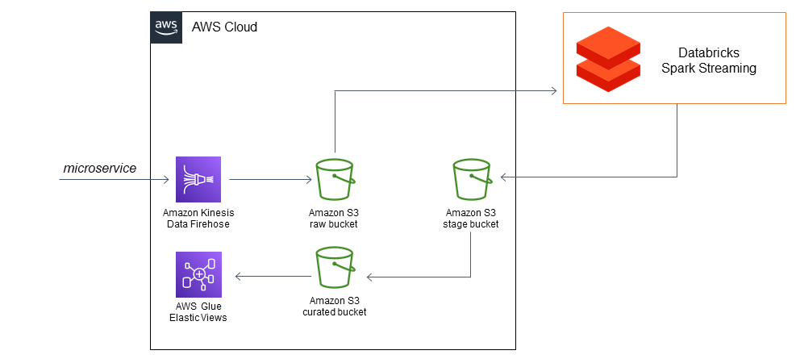

# Kinesis Spark Streaming

Simulação de ingestão de dados utilizando streaming. Transformação feita utilizando SparkStreaming em Databricks, dados prontos em Aws Glue.

## Ferramentas
- Aws Firehose
- Aws S3 Bucket
- Databricks jobs
- Aws Glue
